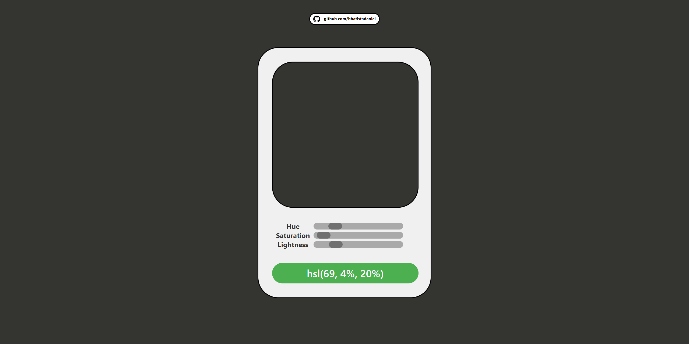

# Color Picker

Color Picker is a web application that allows users to pick and explore colors using the HSL color model. It provides a user-friendly interface with sliders for adjusting the Hue, Saturation, and Lightness values.

## Features

- **Color Display:** The main interface includes a color square that dynamically updates based on the selected HSL values.

- **Hue, Saturation, Lightness Sliders:** Users can adjust the Hue, Saturation, and Lightness values using sliders to explore different colors.

- **Copy HSL Value:** A button allows users to copy the current HSL value to the clipboard.

## How to Use

1. **Hue Slider:** Use the "Hue" slider to adjust the color hue from 0 to 359.

2. **Saturation Slider:** Adjust the "Saturation" slider to control the color saturation from 0% to 100%.

3. **Lightness Slider:** Use the "Lightness" slider to control the brightness of the color from 0% to 100%.

4. **Color Square Display:** The color square dynamically updates as you adjust the sliders, providing a visual representation of the selected color.

5. **Copy HSL Value:** Click the button with the HSL value to copy the current HSL value to the clipboard.

## Project Structure

- **HTML (index.html):** Defines the structure of the color picker web page with sliders and buttons.

- **CSS (style.css):** Styles the HTML elements for a visually appealing and responsive color picker interface.

- **JavaScript (script.js):** Implements the logic for handling user input, updating the color square, and copying HSL values to the clipboard.

## Requirements

- Web browser

## Usage

1. Clone or download the repository to your local machine.

2. Open the `index.html` file in a web browser.

## Screenshot

## License

This project is open-source and is available under the [MIT License](LICENSE). Feel free to use and modify the code as needed.

## Testing

To experience this project, you can visit the following link: [Color Picker](https://bbatistadaniel.github.io/Color-Picker/)
